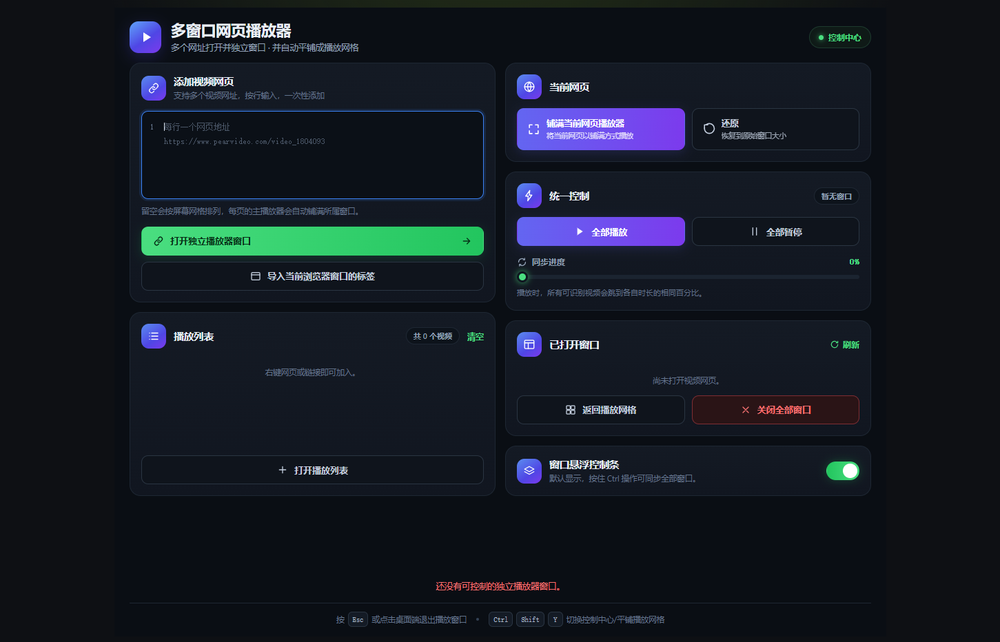

# 多窗口网页播放器

一个面向 Chrome 与 Edge 的 Manifest V3 浏览器扩展：将多个视频网页转为独立播放器窗口，并在桌面上自动平铺。它保留原视频网站的播放流程，适合需要登录、动态加载或防盗链验证的视频网页。

> 本项目只调整本机浏览器的窗口和页面样式，不下载、转存或绕过视频平台的访问限制。



## 功能

- **多个入口**：粘贴多个网页网址、导入当前浏览器窗口标签、或右键将网页/链接加入播放列表。
- **保留当前播放状态**：从浏览器标签导入时，标签会直接移动到独立窗口，不重新加载网页。
- **自动网格布局**：根据窗口数量严格平铺，尽量减少窗口间的缝隙。
- **可选的排列方式**：自动网格 / 单行横排 / 单列竖排 / 一主多副。主副模式可指定哪个窗口当主画面，并用滑杆调主窗口宽度（40%–80%）。
- **视频书签**：在播放窗口记录当前进度，之后一键跳回；可给每条书签写备注（默认留空），书签按网址保存，关闭窗口或浏览器后依然保留。
- **控制中心**：统一播放、暂停、按时长百分比同步进度、管理已打开窗口和播放列表，并可一键关闭全部窗口。
- **网页播放器铺满**：自动识别页面中最大的可见视频元素，铺满其独立窗口。
- **悬浮控制条**：播放/暂停、前进后退 10 秒、进度拖动、静音和时间显示；可从控制中心统一隐藏或显示。
- **快捷统一控制**：按住 <kbd>Ctrl</kbd> 操作悬浮控制条，可同步作用于全部独立窗口。
- **快速切换**：<kbd>Ctrl</kbd> + <kbd>Shift</kbd> + <kbd>Y</kbd> 在控制中心与播放网格之间切换。

## 安装

### 方式一：下载打包好的 `.crx`（推荐）

到 [Releases](https://github.com/Simonhans/multi-window-web-player/releases/latest) 页面下载最新的
`multi-window-web-player-<版本>.crx`，然后：

1. 打开 Chrome 的 `chrome://extensions`，或 Edge 的 `edge://extensions`。
2. 开启右上角的“开发者模式”。
3. 把下载好的 `.crx` 文件拖进这个页面，确认安装。
4. 建议将扩展固定到浏览器工具栏。

### 方式二：以“已解压的扩展程序”加载（开发用）

1. 打开 Chrome 的 `chrome://extensions`，或 Edge 的 `edge://extensions`。
2. 开启右上角的“开发者模式”。
3. 点击“加载已解压的扩展程序”。
4. 选择本项目根目录，即包含 `manifest.json` 的 `web-player-windows` 文件夹。
5. 建议将扩展固定到浏览器工具栏。

修改代码后，在扩展管理页点击“重新加载”即可应用更新。

> 两种方式是**两个独立的扩展**（扩展 ID 不同），书签等本地数据互不相通。
> 从一种换到另一种之前，建议先在控制中心的“视频书签”里点“导出”备份，装好后再“导入”。

## 使用方法

### 方式一：导入已打开的视频页面（推荐）

1. 在同一个浏览器窗口中先打开多个视频网页，并可先让它们各自加载或播放。
2. 点击扩展图标，或按 <kbd>Ctrl</kbd> + <kbd>Shift</kbd> + <kbd>Y</kbd> 打开控制中心。
3. 点击“导入当前浏览器窗口的标签”。
4. 勾选要播放的页面，点击“移入独立窗口”。

选中的标签会移动到独立窗口中，不会重新访问网址，因此已加载内容和当前播放位置通常可保留。

### 方式二：粘贴网页网址

在控制中心的“视频网页网址”输入框中，每行粘贴一个 `http://` 或 `https://` 地址，再点击“打开独立播放器窗口”。

### 方式三：右键加入播放列表

- 在视频网页空白处右键，选择“将当前页面加入多窗口播放列表”。
- 在列表页的视频链接上右键，选择“将此链接加入多窗口播放列表”。

播放列表会显示在控制中心，可逐条移除、清空或一键打开。

### 网格与控制

- 点击“返回播放网格”，或再次按 <kbd>Ctrl</kbd> + <kbd>Shift</kbd> + <kbd>Y</kbd>，即可最小化控制中心并回到全部独立播放窗口。
- 控制中心可对所有窗口统一播放、暂停和同步进度；同步按各视频总时长的相同百分比进行。
- 独立窗口底部的悬浮控制条默认可见。按住 <kbd>Ctrl</kbd> 并操作播放、前后跳转、进度或静音，可对全部窗口执行同样操作。
- 按 <kbd>Esc</kbd>、点击页面右上角“退出铺满”，或使用控制中心的“还原”，可恢复网页原布局。

## 项目结构

```text
web-player-windows/
├── manifest.json          # 扩展清单与权限声明
├── background.js          # 窗口、布局、播放组和网页注入逻辑
├── dashboard.html/css/js  # 独立控制中心容器，高度随内容自适应
├── popup.html/css/js      # 控制中心界面与交互
├── PRIVACY.md             # 数据与隐私说明
└── README.md
```

## 权限说明

| 权限 | 用途 |
| --- | --- |
| `activeTab`、`scripting` | 在用户选择的视频网页中识别播放器并添加控制层。 |
| `tabs`、`windows` | 导入现有标签、创建独立窗口、平铺网格与切换控制中心。 |
| `system.display` | 读取主显示器可用区域，用于计算网格位置。 |
| `storage` | 在本机保存播放列表和悬浮控制条显示设置。 |
| `contextMenus` | 提供“加入播放列表”右键菜单。 |
| `http://*/*`、`https://*/*` | 让用户选择的网页可以被播放器铺满和控制。 |

详细内容见 [PRIVACY.md](PRIVACY.md)。

## 已知限制

- 最适合页面主文档或可访问嵌入框中的原生 `<video>` 元素。
- 使用 DRM、跨站 iframe、原生应用播放器或强隔离脚本的网站，可能无法自动识别、铺满或统一控制。
- `chrome://`、扩展商店等浏览器保护页面不能注入脚本。
- 网站本身的登录、会员、地区、防盗链和播放限制始终有效。
- 原生窗口的标题栏与调整大小边线由 Windows 管理，扩展无法完全移除。

## 贡献

欢迎提交 Issue 或 Pull Request。报告兼容性问题时，请说明浏览器版本、目标网站、复现步骤，以及播放器是否位于 iframe 中。
